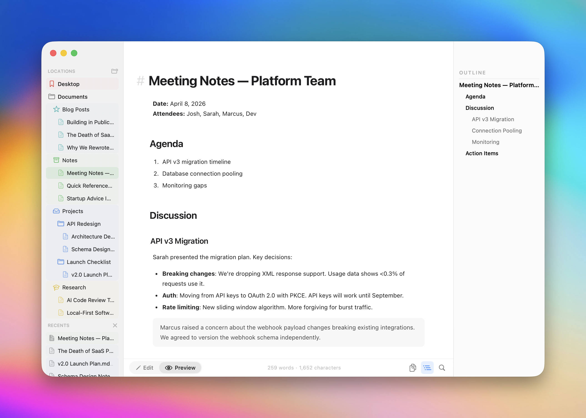

<p align="center">
  
</p>

<h1 align="center">Clearly Markdown</h1>

<p align="center">Un éditeur Markdown natif et un espace de travail documentaire pour macOS.</p>

<p align="center">
  <a href="../README.md">English</a> ·
  <a href="./README.zh-Hans.md">简体中文</a> ·
  <a href="./README.zh-Hant.md">繁體中文</a> ·
  <a href="./README.ja.md">日本語</a> ·
  <a href="./README.ko.md">한국어</a> ·
  <a href="./README.es.md">Español</a> ·
  <a href="./README.ru.md">Русский</a> ·
  <a href="./README.fr.md">Français</a> ·
  <a href="./README.de.md">Deutsch</a> ·
  <a href="./README.it.md">Italiano</a>
</p>

<p align="center">
  <a href="https://github.com/Shpigford/clearly/releases/latest/download/Clearly.dmg">Télécharger</a> &middot;
  <a href="https://clearly.md">Site web</a> &middot;
  <a href="https://x.com/Shpigford">@Shpigford</a>
</p>

<p align="center">
  
</p>

Ouvrez des dossiers, parcourez vos fichiers, écrivez avec coloration syntaxique et prévisualisez instantanément. Pas d’Electron, pas d’abonnement et pas d’encombrement.

## Fonctionnalités

- **Explorateur de fichiers** — ouvrez des dossiers, parcourez des fichiers Markdown dans une barre latérale avec des emplacements favoris et récents
- **Plan du document** — panneau de plan basé sur les titres pour naviguer entre les sections（⇧⌘O）
- **Coloration syntaxique** — titres, gras, italique, liens, blocs de code, tableaux, notes de bas de page, surlignages et plus encore
- **Prévisualisation instantanée** — rendu GitHub Flavored Markdown, y compris les diagrammes Mermaid et les formules KaTeX
- **Coloration syntaxique du code** — 27+ langages via Highlight.js avec numéros de ligne et mise en évidence diff
- **Callouts et admonitions** — `> [!NOTE]`, `> [!WARNING]` et 15 types de callout avec prise en charge du pliage
- **Markdown étendu** — ==highlights==, ^superscript^, ~subscript~, raccourcis :emoji: et génération de `[TOC]`
- **Prévisualisation interactive** — cases à cocher de tâches cliquables, liens d’ancrage de titres, lightbox d’images et popovers de notes de bas de page
- **Accès au code source** — double-cliquez sur n’importe quel élément de la prévisualisation pour aller à sa ligne source dans l’éditeur
- **Prise en charge du Frontmatter** — le YAML Frontmatter est formaté proprement dans l’éditeur et dans la prévisualisation
- **Basculer Editor / Preview** — passez de l’éditeur（⌘1）à la prévisualisation（⌘2）tout en conservant la position de défilement
- **Export PDF** — exportez en PDF ou imprimez directement depuis l’application
- **Raccourcis de formatage** — ⌘B, ⌘I et ⌘K pour le gras, l’italique et les liens
- **Scratchpad** — application de barre de menus avec raccourci global pour capturer des notes rapides sans ouvrir de document
- **QuickLook** — prévisualisez les fichiers `.md` directement dans Finder
- **Clair et sombre** — suit l’apparence du système ou peut être défini manuellement
- **Interface multilingue** — l’interface est disponible en plusieurs langues

## Prérequis

- **macOS 14**（Sonoma）ou version ultérieure
- **Xcode** avec les outils en ligne de commande（`xcode-select --install`）
- **Homebrew**（[brew.sh](https://brew.sh)）
- **xcodegen** — `brew install xcodegen`

Sparkle（mises à jour automatiques）et cmark-gfm（rendu Markdown）sont récupérés automatiquement par Xcode via Swift Package Manager. Aucune configuration manuelle n’est nécessaire.

## Démarrage rapide

```bash
git clone https://github.com/Shpigford/clearly.git
cd clearly
brew install xcodegen    # à ignorer si déjà installé
xcodegen generate        # génère Clearly.xcodeproj depuis project.yml
open Clearly.xcodeproj   # ouvre le projet dans Xcode
```

Ensuite, appuyez sur **⌘R** pour compiler et exécuter.

> **Remarque :** Le projet Xcode est généré à partir de `project.yml`. Si vous modifiez `project.yml`, relancez `xcodegen generate`. N’éditez pas le `.xcodeproj` directement.

### Build CLI（sans interface graphique Xcode）

```bash
xcodebuild -scheme Clearly -configuration Debug build
```

## Structure du projet

```
Clearly/
├── ClearlyApp.swift                # point d’entrée @main — DocumentGroup et commandes de menu（⌘1 / ⌘2）
├── MarkdownDocument.swift          # implémentation FileDocument pour lire et écrire des fichiers .md
├── ContentView.swift               # barre d’outils de sélection du mode, bascule entre Editor ↔ Preview
├── EditorView.swift                # NSViewRepresentable enveloppant NSTextView
├── MarkdownSyntaxHighlighter.swift # coloration basée sur des regex via NSTextStorageDelegate
├── PreviewView.swift               # NSViewRepresentable enveloppant WKWebView
├── Theme.swift                     # couleurs centralisées（clair / sombre）et constantes typographiques
└── Info.plist                      # types de fichiers pris en charge et configuration Sparkle

ClearlyQuickLook/
├── PreviewViewController.swift     # QLPreviewProvider pour les aperçus Finder
└── Info.plist                      # configuration de l’extension（NSExtensionAttributes）

Shared/
├── MarkdownRenderer.swift          # wrapper cmark-gfm — GFM → HTML et pipeline de post-traitement
├── PreviewCSS.swift                # CSS partagé entre la prévisualisation de l’app et QuickLook
├── EmojiShortcodes.swift           # table de correspondance :shortcode: → emoji Unicode
├── SyntaxHighlightSupport.swift    # injection de Highlight.js pour la coloration des blocs de code
└── Resources/                      # JS / CSS embarqués（Mermaid、KaTeX、Highlight.js、demo.md）

website/                 # site marketing statique（HTML / CSS）déployé sur clearly.md
scripts/                 # pipeline de release（release.sh）
project.yml              # configuration xcodegen — source unique de vérité pour les réglages du projet Xcode
ExportOptions.plist      # configuration d’export Developer ID pour les builds de release
```

## Architecture

Application documentaire basée sur **SwiftUI + AppKit** avec deux modes principaux.

### Cycle de vie de l’application

1. `ClearlyApp` crée un `DocumentGroup` avec `MarkdownDocument` pour gérer les E / S des fichiers `.md`
2. `ContentView` affiche un sélecteur de mode dans la barre d’outils et bascule entre `EditorView` et `PreviewView`
3. Les commandes de menu（⌘1 Editor, ⌘2 Preview）utilisent `FocusedValueKey` pour communiquer dans la chaîne de réponse

### Éditeur

L’éditeur enveloppe le `NSTextView` d’AppKit via `NSViewRepresentable` — **pas** le `TextEditor` de SwiftUI. C’est intentionnel : cela fournit un undo / redo natif, le panneau de recherche système（⌘F）et une coloration syntaxique basée sur `NSTextStorageDelegate` exécutée à chaque frappe.

`MarkdownSyntaxHighlighter` applique des motifs regex pour les titres, le gras, l’italique, les blocs de code, les liens, les citations et les listes. Les blocs de code sont traités en premier pour éviter une coloration interne incorrecte.

### Prévisualisation

`PreviewView` enveloppe `WKWebView` et affiche la prévisualisation HTML complète à l’aide de `MarkdownRenderer`（cmark-gfm）stylé par `PreviewCSS`.

### Décisions clés de conception

- **Pont AppKit** — `NSTextView` plutôt que `TextEditor` pour l’undo, la recherche et la coloration syntaxique via `NSTextStorageDelegate`
- **Thème dynamique** — toutes les couleurs passent par `Theme.swift` avec `NSColor(name:)` pour une résolution automatique clair / sombre. N’utilisez pas de couleurs codées en dur.
- **Code partagé** — `MarkdownRenderer` et `PreviewCSS` sont compilés dans l’application principale et l’extension QuickLook
- **Aucune suite de tests** — validez les changements manuellement en compilant, en exécutant et en observant

## Tâches de développement courantes

### Ajouter un type de fichier pris en charge

Modifiez `Clearly/Info.plist` et ajoutez une nouvelle entrée sous `CFBundleDocumentTypes` avec l’UTI et l’extension de fichier.

### Modifier la coloration syntaxique

Modifiez `Clearly/MarkdownSyntaxHighlighter.swift`. Les motifs sont appliqués dans l’ordre : d’abord les blocs de code, puis le reste. Ajoutez de nouveaux motifs regex à la méthode `highlightAllMarkdown()`.

### Modifier le style de la prévisualisation

Modifiez `Shared/PreviewCSS.swift`. Ce CSS est utilisé à la fois par la prévisualisation dans l’application et par l’extension QuickLook. Gardez-le synchronisé avec les couleurs de `Theme.swift`.

### Mettre à jour les couleurs du thème

Modifiez `Clearly/Theme.swift`. Toutes les couleurs utilisent `NSColor(name:)` avec des fournisseurs dynamiques clair / sombre. Mettez aussi à jour le CSS correspondant dans `PreviewCSS.swift`.

## Tests

Il n’y a pas de suite de tests automatisée. Vérifiez manuellement :

1. Compilez et lancez l’application（⌘R）
2. Ouvrez un fichier `.md` et vérifiez la coloration syntaxique
3. Passez en mode prévisualisation（⌘2）et vérifiez le rendu
4. Testez QuickLook en sélectionnant un fichier `.md` dans Finder puis en appuyant sur Espace
5. Vérifiez les modes clair et sombre

## Site web

Le site marketing est un HTML statique dans `website/`, déployé sur [clearly.md](https://clearly.md).

- `website/index.html` — page d’accueil（la chaîne de version est à la ligne 174）
- `website/privacy.html` — politique de confidentialité
- `website/appcast.xml` — flux de mise à jour automatique Sparkle（mis à jour par `scripts/release.sh`）

## Configuration de AI Agent

Ce dépôt inclut un fichier `CLAUDE.md` avec tout le contexte d’architecture et des compétences Claude Code dans `.claude/skills/` pour l’automatisation des releases et l’onboarding de développement. Si vous utilisez Claude Code, tout cela est détecté automatiquement.

## Licence

FSL-1.1-MIT — voir [LICENSE](../LICENSE). Le code devient MIT au bout de deux ans.
